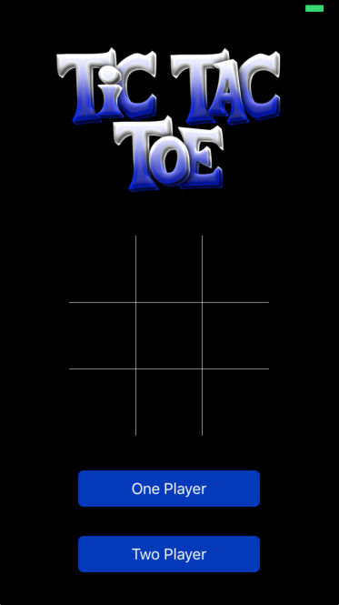
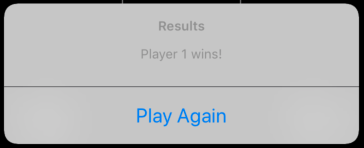

# Tic Tac Toe



Tic-Tac-Toe iOS Game developed using Swift 4 and Xcode 9.4.1. Implemented introductory UX operations such as name customizations, allowing choice of which player makes the first move, and keeping score to determine winner of a 'Best-of' series. 
Project made to test various programmatic concepts using Swift such as passing data between View Controllers and utilizing Custom Segues.
</br>

</br>


<h1>Future Enhancements:</h1>
<ul>
  <li> Thorough Testing </li>
  <li> Implement Computer UI using minimax </li>
  <li> Best-of Series feature </li>
  <li> Various animations such as drawing winning lines before announcing winner </li>
  <li> Introduce Computer AI in One-Player mode with varying difficulty </li>
</ul>

</br>

<h1>Latest Adjustments:</h1>
<ul>
  <li> 08/12/2018 - 'First-to-move' selection added. If none is selected, defaults to 1st player </li>
  <li> 08/11/2018 - Introduce alternating turns functionality when a winner is declared </li>
  <li> 08/11/2018 - Convert toast message to pop-up using UIAlertController </li>
  <li> 08/10/2018 - Created toast message functionality to declare state of game (i.e: win/lose/tie) </li>
</ul>


</br>


<h1>Notes:</h1>

<h3> Passing Data between View Controllers </h3>

</br>

<p> For the purpose of simplification and readablity, the two View Controllers in queston for this section will be named FirstViewController and SecondViewController respectively. </p>

<p>
  For this application, the data that needed to be passed from FirstViewController to SecondViewController originated from input entered into UITextField(s). The number of UITextFields is determined by which game mode the user wanted to play. 
</p>

<p> 
  First, navigate to Main.storyboard and create an IBOutlet for the UITextFeild(s) within FirstViewController. 
  
```swift
    @IBOutlet weak var playerOneTF: UITextField!
    @IBOutlet weak var playerTwoTF: UITextField! // Optional based on selection (one or two player)
```  

The data the user enters into the following UITextFeild(s) can be accessed using the '.text' property and assigning the value to a variable that will be passed to SecondViewController. In order to complete this process, an action needs to be triggered that will pass the data as well as complete a segue to move to SecondViewController.

Create a Manual Segue in Main.storyboard from FirstViewController to SecondViewController and set the identifier to 'goToSecondViewController'. 

</p>

<p>
  Create an IBAction for a UIButton in FirstViewController named 'startBtn' with the following processes to complete when pressed:  
  
```swift
  // Two-player game setting
  @IBAction func startBtnPressed(_ sender: Any) {
        
        // If empty, defaults to 'Player 1' or 'Player 2' respectively.
        if let name = playerOneTF.text, !name.isEmpty {
            self.playerOneName = name
        } else {
            self.playerOneName = SOME_DEFAULT_STRING_NAME // (i.e. 'Player 1')
        }
        
        if let name = playerTwoTF.text, !name.isEmpty {
            self.playerTwoName = name
        } else {
            self.playerTwoName = SOME_DEFAULT_STRING_NAME // (i.e. 'Player 2')
        }
        
        performSegue(withIdentifier: "goToSecondViewController", sender: self)
        
    }
```

</p>


<p>
  Before the segue is actually completed, prepare to pass the data within FirstViewController (i.e. names entered into UITextField(s)) to SecondViewController and receive it into String variables. 
  Within SecondViewController, create the following variables to receive the data:
  
  ```swift
    var playerOneName : String = ""
    var playerTwoName : String = ""
  ```
  
  Within FirstViewController, we can now send the values entered in the UITextField(s) using the following function:
  
  ```swift
    override func prepare(for segue: UIStoryboardSegue, sender: Any?) {
        if segue.identifier == "goToSecondViewController" {
            let destinationVC = segue.destination as! SecondViewController
            
            // Access player names within this file and sets the value(s) in destination view controller
            destinationVC.playerOneName = self.playerOneName
            destinationVC.playerTwoName  = self.playerTwoName // Optional based on selection (one or two players)
        }
    }
  ```
  
  
  
</p>
 
<p>
  Next step was to format SecondViewController to assign the received data to labels in the header. Within Main.storyboard, we created two labels linked them to IBOutlets within SecondViewController. 
  
  ```swift
    @IBOutlet weak var playerOneLabel: UILabel!
    @IBOutlet weak var playerTwoLabel: UILabel! // Optional based on selection (one or two players)
  ```
 
 Now all that is left is to assign the label(s) text attribute to the name(s) passed from FirstViewController. This can be done within the viewDidLoad() function like so:
 
 ```swift
    playerOneLabel.text = "\(playerOneName)"
    playerTwoLabel.text = "\(playerTwoName)"
 ```
 
</p>


</br>
</br>


<h3> 
  Pop-Up Message using UIAlertController 
</h3>

</br>

<p> 
  
  Utilized UIAlertController as a way to allow a clean reset of play as well as a notification to declare the winner (if any) or a tie. The application required a way to serve as a notification (similar to a toast) as well as a SINGLE button to allow the user to reset the game. 
</p>


<p>
  
  The following function creates the UIAlertController with the ActionSheet style, adds an action to the Controller to execute any necessary functions (in this case, clears the board), and presents the pop up at the bottom of the screen. 
  
  ```swift
  
    func showPopUpMessage(declaredWinner : String) {
        let alert = UIAlertController(title: "Results", message: declaredWinner, preferredStyle: .actionSheet)
        
        alert.addAction(UIAlertAction(title: "Play Again", style: .default, handler: { action in
            // Insert any methods to execute upon 'Play Again' selection
            self.clearBoard()
        }))
        
        self.present(alert, animated: true)
    }
  
  ```
  
  
</p>


<p>
  
  
  
  The function can be called anywhere in the program with any parameters, however, for this application, it made sense to call this function every time a winner was detected OR the board filled and the game ended in a tie. The following method was used to check if the current state of the board contained a winning line (i.e. rows, columns, or diagonals) and presents UIAlertController with the respective information. 
  
  
  ```swift
  
        // Check if board has a winner
        for line in winningLines {
            if board[line[0]] != 0 && board[line[0]] == board[line[1]] && board[line[1]] == board[line[2]] {
                // Winning line detected
                if board[line[0]] == 1 {
                    // Player one wins
                    playerOneScore += 1
                    showPopUpMessage(declaredWinner: "\(playerOneName)" + " wins!")
                    updateHeader() // Update scores
                } else {
                    // Player two wins
                    playerTwoScore += 1
                    showPopUpMessage(declaredWinner: "\(playerTwoName)" + " wins!")
                    updateHeader() // Update scores
                }
            }
        }
        
        isActive = false
        
        // Checking board for ties
        for i in board {
            if i == 0 {
                isActive = true
                break
            }
        }
        if isActive == false {
            // Tie occurred
            showPopUpMessage(declaredWinner: "It's a tie!")
        }


  
  ```
  
</p>


